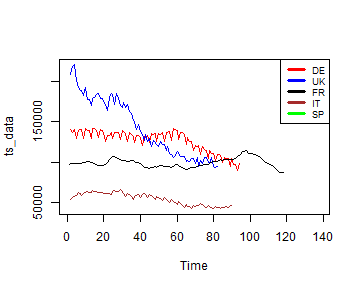

## Motivation and Data Set

The office of statistics of the European Union offers a variety of datasets. In this case, we are using the following dataset:

[Quarterly National Accounts by 10 branches - employment data (namq_nace10_e)](http://ec.europa.eu/eurostat/cache/metadata/en/ei_qna_esms.htm)

The interface provided is very basic so I thought it would be a good example to be used.

It was downloaded on the 4/17/2016 and contains quarterly data from the first quarter of 1980 until second quarter of 2014. Last data update was done 9/19/2014

Original and converted data is provided in the project.

--- .class #id

## Data Preparation

The following steps were done:

1. It was imported to R Studio as a CSV file
2. The data format was corrected to be numeric
3. The first column was expanded to individual columns
4. All lines representing aggregated values were purged
5. Afterwarts the file was saved for easy access.

The code for this is provided in the server.ui file as a comment.

Also, look up tables are provided for parameter values.

--- .class #id

## Usage of the Interface
The interface splits in two parts:

On the left side, filter criterias can be selected:

1. NACE as an industry selector
2. Unit for the observations to be measured in (be aware that percentual values with a NACE code of all industries result in 100% values)
2. Seasonal adjustment as the employment market usually shows a local height in winter and local low in summer
3. Type of employment like self-employed
4. A slider to select the specific quarter

On the right side, there is an overview over the major EU nations (Germany, UK, France, Italy, and Spain) with a red line indicating the selected quarter. Below this, there are an interactive map displaying the data specific to the quarter, an histeresis, and a comparison over all EU countries.

--- .class #id

## Example Case to Look At

The following configuration NACE real estate, unit thousands of working hours, unadjusted seasons, and all employment as indicator, results in the following plot:

It is interesting to see the constant increase in the UK while all other major nations stay constant.
